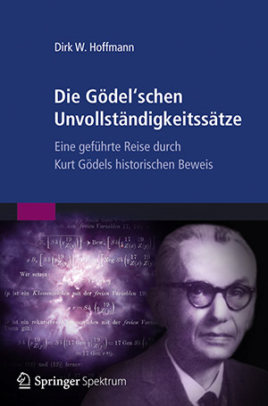

## D. Hoffmann: "Die Gödel'schen Unvollständigkeitssätze" (2013)

- Vorwort (3)
- 1 Einleitung (13)
  - 1.1 Die axiomatische Methode
  - 1.2 Formale Systeme
  - 1.3 Metamathematik
  - 1.4 Die Unvollständigkeitssätze
  - 1.5 Die Gödel’sche Arbeit 
- 2 Die formalen Grundlagen der Mathematik (43)
  - 2.1 Das logizistische Programm
  - 2.2 Die natürlichen Zahlen
  - 2.3 Principia Mathematica
  - 2.4 Axiomatische Mengenlehre
- 3 Beweisskizze (119)
  - 3.1 Arithmetische Formeln
  - 3.2 Arithmetisierung der Syntax
  - 3.3 Ich bin unbeweisbar!
  - 3.4 Gödel, Richard und der Lügner
- 4 Das System P (147)
  - 4.1 Syntax
  - 4.2 Semantik
  - 4.3 Axiome und Schlussregeln
  - 4.4 Formale Beweise
  - 4.5 Arithmetisierung der Syntax
- 5 Primitiv-rekursive Funktionen (213)
  - 5.1 Definition und Eigenschaften
  - 5.2 Auswahl primitiv-rekursiver Funktionen und Relationen
  - 5.3 Entscheidungsverfahren
  - 5.4 Satz V
- 6 Die Grenzen der Mathematik (289)
  - 6.1 Gödels Hauptresultat
  - 6.2 Der erste Unvollständigkeitssatz
  - 6.3 Der zweite Unvollständigkeitssatz
- 7 Epilog (349)

-----

## Vorwort

>Über Tausende von Jahren war es die unausgesprochene Grundannahme der Mathematik, dass sich jede mathematische Aussage entweder beweisen oder widerlegen lässt. 1931 wurde dieser Traum durch Kurt Gödel zu Grabe getragen. Der junge Mathematiker hatte entdeckt, dass der Begriff der Wahrheit und der Begriff der Beweisbarkeit nicht in Einklang gebracht werden können [...]

Arbeiten, die Grenzen definieren, die wir nicht überwinden können:

- Einstein'sche Arbeit zur Begründung der **Relativitätstheorie** ("Zur Elektrodynamik bewegter Körper", 1905)
- Heisenberg'sche Arbeit über die **Unschärferelation** ("Über den anschaulichen Inhalt der quantentheoretischen Kinematik und Mechanik", 1927)
- Gödel'sche Arbeit über **Unvollständigkeit** ("Über formal unentscheidbare Sätze der Principia Mathematica und verwandter Systeme", 1931)

## 1 Einleitung

>Die Mathematik des beginnenden zwanzigsten Jahrhunderts wurde von drei philosophischen Grundströmungen dominiert, die am ersten Tag der Konferenz in 60-minütigen Vorträgen ausführlich vorgestellt wurden. Als erster trug der deutsche Philosoph Rudolf Carnap über den **Logizismus** vor, danach erläuterte der niederländische Mathematiker Arend Heyting den **Intuitionismus**, und zu guter Letzt referierte der in Österreich-Ungarn geborene Mathematiker John von Neumann über den **Formalismus**.

>Bekannt wurde er [Euklid] durch seine Schrift *Die Elemente*, in denen er die griechische Mathematik der vorangegangenen dreihundert Jahre zusammenfasste. Sein Werk bestand aus 13 Teilen, die wir heute als Kapitel bezeichnen würden und die bei Euklid Bücher heißen.

>Während die Sätze der *Elemente* im Wesentlichen auf 5 Hauptpostulaten fußen, setzt sich das Hilbert’sche System aus insgesamt 21 Axiomen zusammen, die in 5 Gruppen eingeteilt sind.

>Im ersten Schritt definieren wir **die Syntax des formalen Systems**, d. h., wir legen fest, aus welchen Zeichen und nach welchen Regeln die Formeln aufgebaut sind, die innerhalb des Systems existieren. Im zweiten Schritt werden **die Axiome und die Schlussregeln** eingeführt. Sie definieren, wie aus den Axiomen und dem b ereits Bewiesenen neue Theoreme gewonnen werden können.

Beweisbarkeitsrelation:

>Die Definition klärt auch die Bedeutung des Zeichens ‚⊢‘, das in den Ableitungssequenzen am Anfang jeder Zeile auftaucht. Es drückt aus, das eine Formel beweisbar ist, d.h. durch die wiederholte Anwendung von Schlussregeln aus den Axiomen hergeleitet werden kann.

Modellrelation:

>Erst auf der Bedeutungsebene sind wir in der Lage, von wahren und von falschen
Aussagen zu sprechen. Symbolisch verwenden wir hierfür das Zeichen ‚⊨‘, in
Anlehnung an das bereits eingeführte Zeichen ‚⊢‘

Metaeigenschaften formaler Systeme>

>Die Widerspruchsfreiheit und die Negationsvollständigkeit sind Begriffe, die ausschließlich die syntaktische Ebene eines formalen Systems berühren [...]

>Die Korrektheit und die Widerspruchsfreiheit sind Begriffe, die einen Zusammenhang zwischen der syntaktischen und der semantischen Ebene herstellen.
